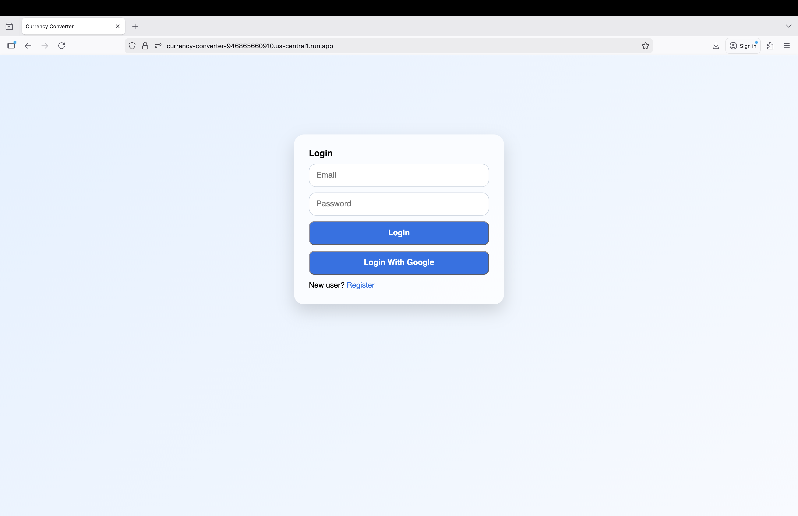
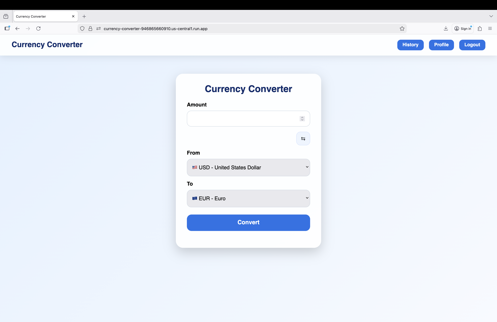
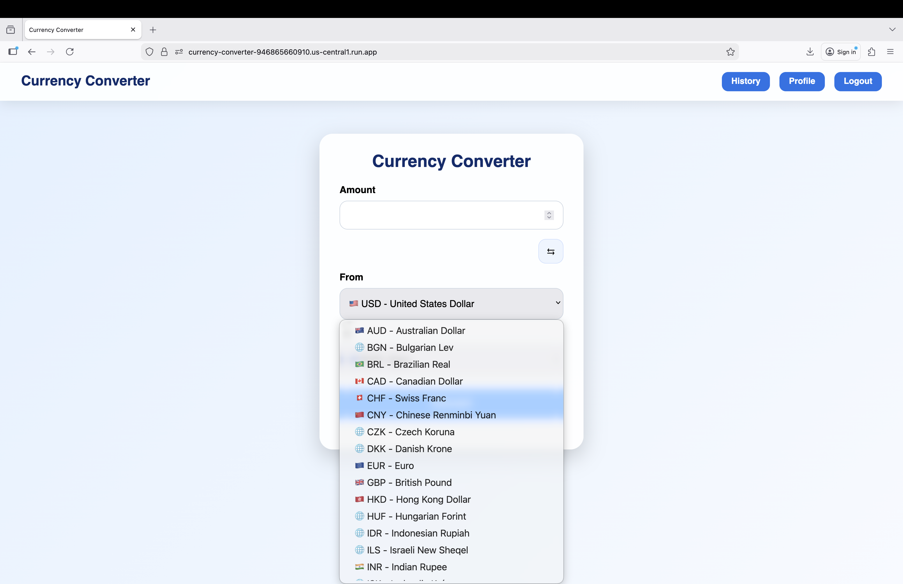
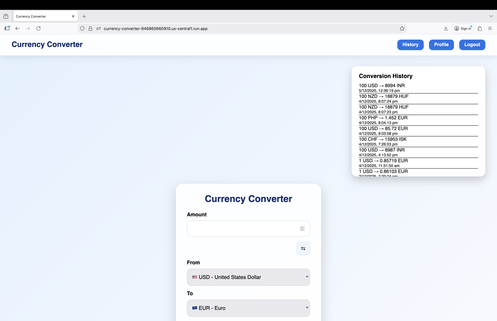

# Real-Time-Financial-Data-Application-
Real-Time Financial Data Application with Cloud Deployment on GCP(Currency Converter)

---

##  1. Project Overview

The **Web Application** is a cloud-ready web application that enables users to convert currencies in real time and securely store their conversion history.
The backend is **containerized using Docker** and deployed on **Google Cloud Run**, ensuring scalability, portability, and zero server management.

User authentication is handled via **Firebase Authentication**, while conversion history is stored in **Firestore**, a NoSQL database.

This project demonstrates modern application development using:

* Containerization
* Serverless deployment
* Secure authentication
* Cloud database integration

---

##  2. Technologies Used

### **Frontend**

* React (via CDN)
* HTML, CSS, JavaScript
* Firebase Web SDK
* Frankfurter API (live currency rates)

### **Backend**

* Node.js
* Express.js
* Firebase Admin SDK

### **Containerization**

* Docker

### **Google Cloud Platform**

* **Cloud Run** (serverless backend hosting)
* **Artifact Registry** (Docker image storage)
* **Cloud Build** (automated container builds)
* **Firestore Database** (storing conversion history)
* **Firebase Authentication** (Google + Email login)

---

##  3. Features

### **Core Features**

* Real-time currency conversion
* Secure user login (Google or Email/Password)
* Personalized conversion history
* Clean, responsive UI

### **Cloud & Backend Features**

* Dockerized backend for portability
* Auto-scaling serverless deployment on Cloud Run
* Firestore-based persistent user data
* Token-based request authentication

---

## 4. Project Workflow Summary

**Flow Description:**

1. User logs in using Firebase Authentication
2. Frontend obtains a secure ID token
3. Frontend sends API requests with the token
4. Backend verifies token and processes request
5. Cloud Run executes backend code inside Docker container
6. Firestore stores or retrieves user conversion history

---

##  5. Final Outcome

The completed system is:

* Fully cloud-deployed
* Secure with token-based authentication
* Scalable using serverless technology
* Modular and easy to maintain
* Fast and user-friendly

Users can:

* Log in securely
* Convert any supported currency
* View their entire conversion history

Screennshots of the Project

* Login Page


* Main Interface
* 




* Conversion History Page



---

##  6. Future Enhancements

Potential improvements include:

* Multi-language UI
* Analytics dashboard for historical trends
* Caching currency rates for faster responses
* Full UI/UX redesign
* Adding Google Cloud Storage for exporting history

---

##  7. Conclusion

This project successfully demonstrates how to build a **modern, production-ready web application** using:

* **Docker** for containerization
* **Firebase Authentication** for secure access
* **Firestore** for persistent storage
* **Google Cloud Run** for serverless deployment

It showcases real-world, industry-style cloud development practices and integrates frontend, backend, and cloud technologies into one seamless system.

---

# 🔧 8. Setup Instructions (For Anyone Who Wants to Run the Project)

Follow these steps to run the project locally.

---

## **A. Clone the Repository**

```sh
git clone https://github.com/your-username/currency-converter.git
cd currency-converter
```

---

## **B. Install Backend Dependencies**

```sh
npm install
```

---

## **C. Create Firebase Credentials**

Create a file:

```
serviceAccountKey.json
```

Add your Firebase Admin credentials (never commit this file to GitHub).

---

## **D. Add Environment Variables**

Create a `.env` file:

```
FIREBASE_KEY=./serviceAccountKey.json
```

---

## **E. Run the Backend Locally**

```sh
node server.js
```

Your server will run at:

```
http://localhost:8080
```

---

## **F. Open the Frontend**

Open the `public/index.html` file in a browser.

---

## **G. Docker (Optional)**

Build the container:

```sh
docker build -t currency-converter .
```

Run it locally:

```sh
docker run -p 8080:8080 currency-converter
```

---

**Contributors**

* Gayatri Nimbolkar 

* Ruchira Patil 

* Larry Lopes 
